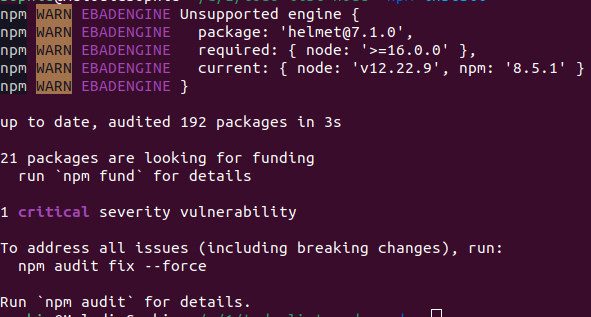
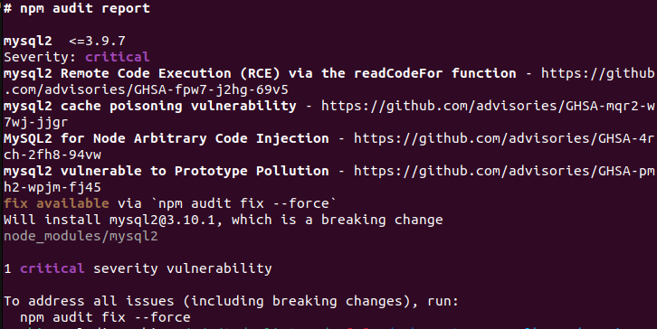
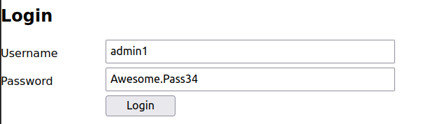
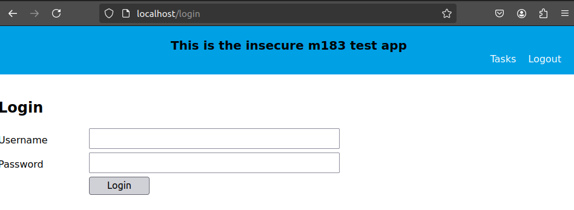
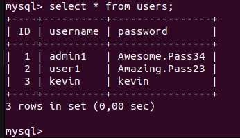

# Disclaimer

The code provided in this repository is intended for educational and research purposes only. It demonstrates vulnerabilities and security issues related to OWASP A07 (Identification and Authentication Failures) and OWASP A09 (Security Logging and Monitoring Failures).

By using this script, you agree to the following terms:

- You will use the script responsibly and solely for educational and lawful purposes.
- You will not use the script to engage in any activities that are illegal or harmful.
- You understand that the authors of this repository do not take any accountability or responsibility for any misuse or damage caused by the use of this script.

**It is your responsibility to ensure that your use of the script complies with all applicable laws and regulations.**

# LB2

## Found Security Risks
1. ~~No Logs~~
2. Console displays login information 
3. Login Credentials in SQL script (not exactly a risk but could be done differently)
4. Login Credentials not hashed
5. ~~Security voulnerabilty with mysql package~~
6. bypass login with edit of cookies
7. server crash if cookies are filled incorectly
8. /admin/users route accesible as long as cookies are filled
9. ~~http is insecure~~
10. ~~login config for database in js~~

## Added Functionalities

### Logs

- General Secutirty Logs

### Authentication & Authorization

- Passkey implementation

# LB2 Phase 2
 - Testing of App from Mr. Zingg

## NOTES:
 - Modification Required to test rest of app, changing SQL params for login 

## 1. Security Voulnerability

### Usage of Voulnerable npm package

### What did i do?
i used npm install to install the files nescecarry for the code to run in docker

### What did i expect?
no security voulnerable packages

### What was the result?
A critical security voulnerable package

## 2. Password

### What did i do?
i entered username and password into the login form
### what did i expect?
Password to be a password form
### What was the result?
Password showed up as plain text

## 3. Parameters

### What did i do
i tried to login
### what did i expect
parameters not to show up in the request
### what did happen
parameters are in the get request as plain text

## 4. HTTP

### What did i do
i opened localhost
### What did i expect
i expected a https connection
### what did i get
i got a http connection

## 5. Login

### What did i do
i tried to login after having had to modify the code in ordrr for it to not automaticly lock me out

### What did i expect
to get to the tasks page

### What did happen

i got a weird alagumation of the tasks and login page, when i clicked on any of the links it had a simmilar result to a failed login, which would then result in me getting locked out for 15 minutes

## 6. Lockout
### What did i do
i failed to log in 3 times
### what did i expect to happen
i expected t be locked out for 5 minutes
### what did happen
i got locked out, however as it was a 15 minute lock out it felt more as a Denial of service than a feature

## 7. Owasp Zap
### what did i do?
i ran owasp zap
### what did i expect to happen
no voulenrabuilkites or very few
### what did happen
no voulnerabilities found, but that may have to do with the fact that the app dosnt run correctly

## 8. cookie to block bypass
### what did i expect to find
i expected something like a jwt or csrf cookie
### What did i find
i found a Csrf cookie so good job

## 9. Admin/users route
### what did i expect to find
a different way of locking out than jsut checking for logged in people
### what did i find
the same type of lockout as the rest so standart user can access

## 10. MySQL hash

### What did i expect
passwords to be saved as a hash
### what did i find
Passwords saved as plain text

## 11. .env
### What did i expect
the credentials to not be stored within the scrtipt
### what did i find
the credentials are in a .env file BUT they are also in the scrip should it fail to load the dotenv

## 12. hidden field password in admin/users
### what did i expect
password not to even show up
### what did i find
password still shows up

## 13. SQL injections
### What did i expect
statement to be verified when doing a search for tasks
### what did i find
its possible to do a sql injection, in qhich case it may also be possible to do a command injection, however i cant test this as the app is not working correctly

## 14. XSS
### what did i expect
evaluation of code when displaying variables
### what did i find
no evaluation of code

## 15. Edit
### What did i do
opened the app and clicked edit
### What did i expect
the edit page to open and a task to be editable
### What did happen
tasks wasnt openable and got locked out for 15 minutes

## 16. create
### what did i do
tried creating a task
### What did i expect
a task to be able to be created
### what did happen
tasks wasnt able to be created and got locked out for 15 minutes

## 17. remove
### What did i expect
the code to have a /remove endpoint
### what did i find
no /remove endpoint

# Honestly i currently have no idea for further tests i can do, really all of this  testing was performed by ERMFox (Soph), look into the git logs
